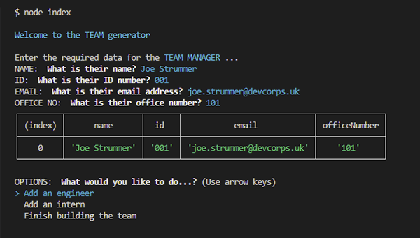

# 12-dev-team-builder

## Description

This application will take in information about employees in a software engineering team, then generates an HTML webpage that displays summaries for each person.   

Tests are provided to check the code functionality.

## Installation

The directory must be downloaded to a **Node.js environment**. Version **16.13.0** was used for this build.      
- Relevent dependancies can be installed with `npm install`   

## Usage

The app is initialised with the terminal command `node index`   
- Follow the commands in the terminal window...  

  

Here is an example of a **DEV TEAM BUILDER** generated by the app:  

A [**sample--team.html**](https://github.com/forestDean/12-team-profile-generator/blob/8c684da96942be0a5f15848161a93770b023b494/output/sample--team.html) can be found in the root directory.

## Tests

The built-in tests use `Jest` to check the code functionality of the app classes.   
- The tests are initialised with the terminal command `npm run test`

## Credits

- npm Inquirer v8.2.5 - https://www.npmjs.com/package/inquirer/v/8.2.5
- npm Chalk - https://www.npmjs.com/package/chalk

## Questions

- GitHub: https://github.com/forestdean   
- Email: email@forestdean.com   

## License

MIT License - A short and simple permissive license with conditions only requiring preservation of copyright and license notices. Licensed works, modifications, and larger works may be distributed under different terms and without source code.
